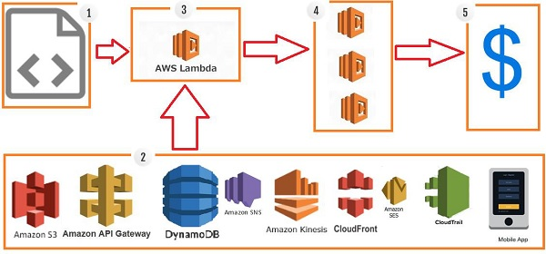

# AWS Lambda

- Serverless cloud service that provides a new way to run event-driven applications as a service.
- A service which computes the code without any server.
- It is executed based on the response of events in AWS services such as adding/removing files in `S3 bucket`, updating `Amazon DynamoDB` tables, HTTP request from `Amazon API Gateway` etc.
- It executes your code only when needed and scales automatically, from a few requests per day to thousands per second.

### Steps of executions



1. upload lambda function in aws

2. "Amazon S3", "Amazon API Gateway", "DynamoDB", "Amazon SNS", "Amazon Kinesis", "CloudFront", "Amazon SES" services on which lambda can be triggered.

3. AWS Lambda which has the upload code and the event details on which the trigger has occurred.

eg: event from Amazon S3, Amazon API Gateway, Dynamo dB

4. Executes AWS Lambda Code only when triggered by AWS services under the scenarios such as −

- User uploads files in S3 bucket
- http get/post endpoint URL is hit
- data is added/updated/deleted in dynamo dB tables
- push notification
- data streams collection
- hosting of website
- email sending

5. AWS charges only when the lambda code executes.

### Use Cases

1. `S3 with lambda`

```
S3 passes the event detail to lambda when there is any file upload in S3.
```

2. `DynamoDB with lambda`

```
DynamoDB can trigger lambda when data is added, updated and deleted in the table.
```

3. `API Gateway with lambda`

```
API Gateway can trigger lambda on GET/POST methods
```

4. `SNS with lambda`

```
SNS is used to push notification or sending SMS can trigger lambda.
```
